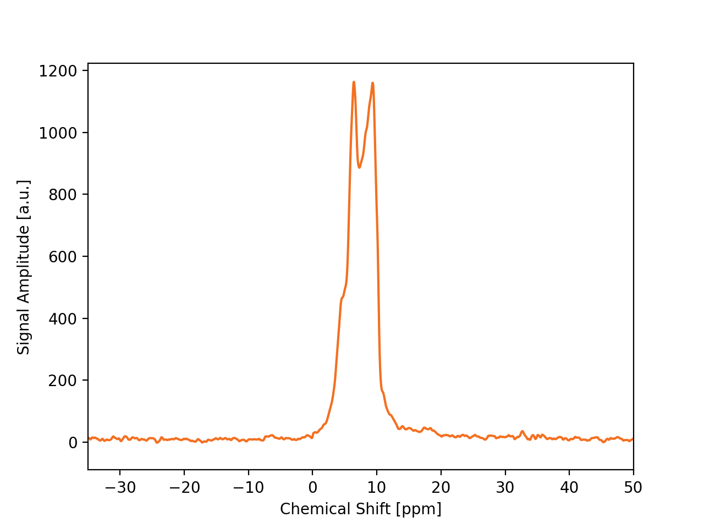
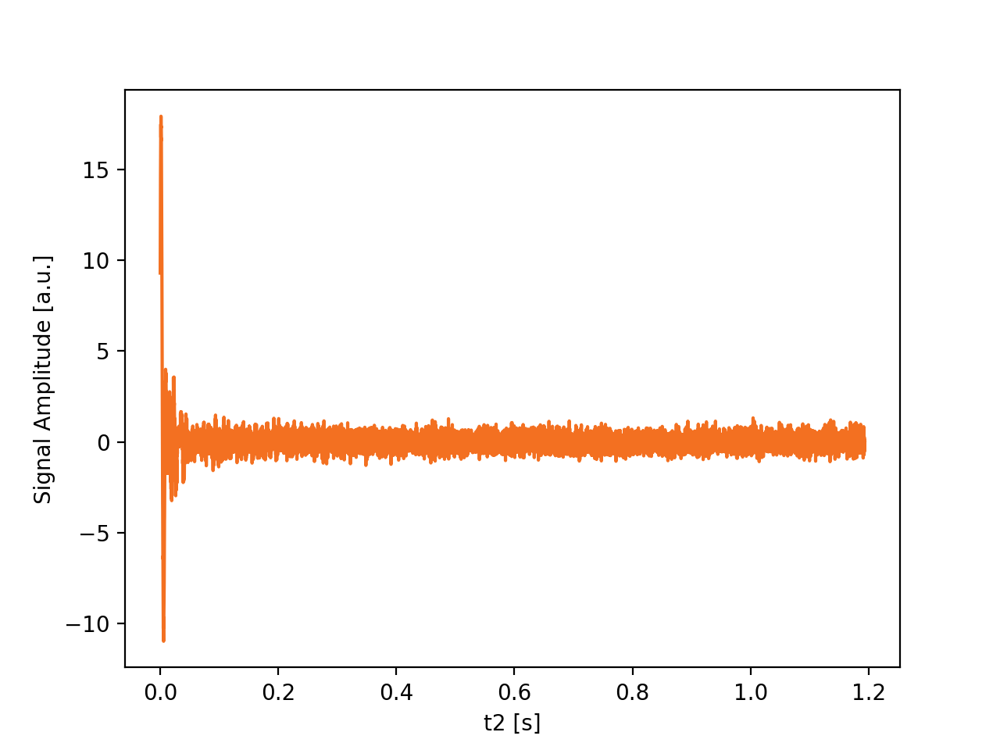
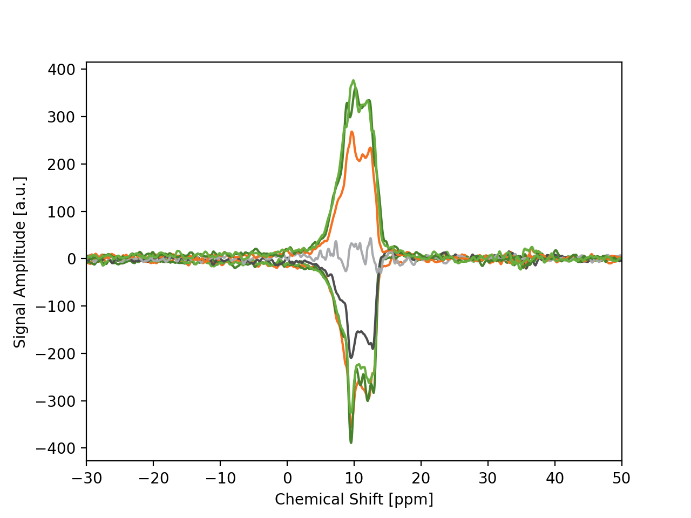
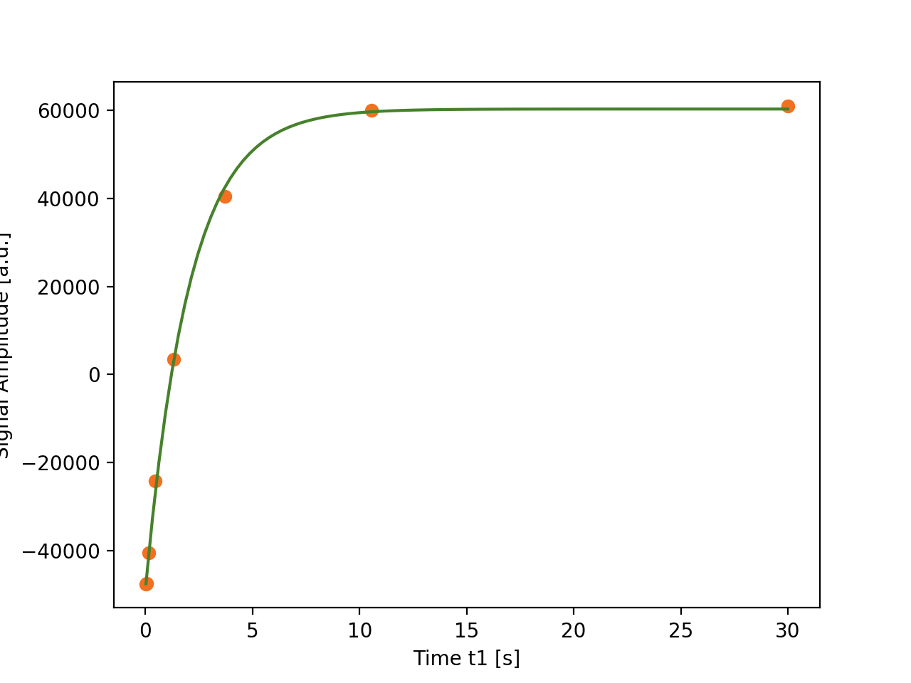

===============
dnpLab Examples
===============

.. |ExamplesLink| raw:: html

   <a href="https://github.com/DNPLab/dnpLab/tree/master/examples" target="_blank"> Link to Examples</a>

.. |DataLink| raw:: html

   <a href="https://github.com/DNPLab/dnpLab/tree/master/data" target="_blank"> Link to Data</a>

dnpLab comes with many example scripts to demonstrate how the package can be used to import data from different spectrometer platform, process NMR data and extract enhancement data or hydration information. The example scripts are located in the *examples* folder using sample data located in the *data* folder.

If you installed dnplab using pip you can download the example scripts and data from the GitHub repository:

.. list-table::
   :widths: 50 50

   * - Example Scripts:
     - |ExamplesLink|
   * - Example Data:
     - |DataLink|

Import Data and Process FID (Bruker Format)
===========================================
This example uses the example script: *example_process_1Dbruker.py*. The script demonstrates the following features of dnpLab:

#. Load a single FID (Bruker format)
#. Perform an offset correction
#. Apply apodization to the FID
#. Perform a Fourier transformation
#. Phase correct the resulting spectrum

If you installed dnplab using pip. Otherwise, you have to specify the path to the package explicitly:

.. code-block:: python

   import numpy as np
   import dnplab as dnp

.. note::
   If you downloaded dnplab via GitHub and haven't installed, you must add the directory for dnplab to the system path before importing dnplab. Add the following lines to the beginning of the script:

   .. code-block:: python

      import sys
      sys.path.append('path/to/dnplab/package')

In the next step load a single FID in Bruker format:

.. code-block:: python

    path = 'path/to/data/topspin/'
    folder = 20

    data = data.dnpImport.topspin.import_topspin(path,folder)

The topspin import module requires the path and the folder number.
In the next step the workspace is set up and the imported data is added to the *raw* workspace and the same data is copied to the *proc* workspace.

.. code-block:: python

    ws = dnp.create_workspace()
    ws.add('raw', data)
    ws.copy('raw', 'proc')

.. note::

    When working with dnpLab one of the first steps is to copy the imported data to the *raw* workspace. That way the raw data and all its attributes will be always accessible to the user. When saving data with dnpLab the raw data is saved together with the processed data. dnpLab uses the h5 format to store data. 

In the following steps, the FID is processed and the spectrum is plotted.

.. code-block:: python

    dnp.dnpNMR.remove_offset(ws,{})
    dnp.dnpNMR.window(ws,{'linewidth' : 10})
    dnp.dnpNMR.fourier_transform(ws,{'zero_fill_factor' : 2})
    dnp.dnpNMR.autophase(ws,{})

In this example first a baseline correction is performed (dnpNMR.remove_offset) and apodization is applied ot the FID (dnpNMR.window). In this example a line broadening of 10 Hz is applied. The next step is to Fourier transform the FID (dnpNMR.fourier_transform) and phase the spectrum (dnpNMR.autophase).

To plot the NMR spectrum: 

.. code-block:: python

    dnp.dnpResults.figure()
    dnp.dnpResults.plot(ws['proc'].real)
    dnp.dnpResults.xlim([-35,50])
    dnp.dnpResults.plt.xlabel('Chemical Shift [ppm]')
    dnp.dnpResults.plt.ylabel('Signal Amplitude [a.u.]')
    dnp.dnpResults.show()

.. _Index_1DBrukerReal:

    1D NMR Spectrum Imported in Bruker Format

Here only the real part of the spectrum is displayed (dnpResults.plot(ws['proc'].real)). The imaginary part of the spectrum can be displayed by changing the second line to

.. code-block:: python

    dnpResults.plot(ws['proc'].imag)

To display the unprocessed raw FID:

.. code-block::

    dnp.dnpResults.figure()
    dnp.dnpResults.plot(ws['raw'].real)
    dnp.dnpResults.plt.xlabel('t2 [s]')
    dnp.dnpResults.plt.ylabel('Signal Amplitude [a.u.]')
    dnp.dnpResults.show()

.. _Index_1DFIDBrukerReal:

    1D FID from raw data (Bruker Format)

Determine T1 from an Inversion Recovery Experiment
==================================================

In this example, the data from an inversion recovery experiment is analyzed to extract the longitudinal relaxation time T1 from the polarization build up. This example uses the example script: *example_process_IRbruker.py*.

First, import the experimental data (Bruker format) (if dnplab is installed through pip, ignore the first two lines):

.. code-block:: python

   import sys
   sys.path.append('path/to/dnplab/package')

   import numpy as np
   import dnplab as dnp

In the next step load a single FID in Bruker format:

.. code-block:: python

    path = 'path/to/data/topspin/'
    folder = 304

    data = dnp.dnpImport.topspin.import_topspin(path,folder)

Next, create the workspace:

.. code-block:: python

    ws = dnp.create_workspace()
    ws.add('raw', data)
    ws.copy('raw', 'proc')

Next, process the FID, perform Fourier transformation, align and phase the NMR spectra:

.. code-block:: python

    dnp.dnpNMR.remove_offset(ws,{})
    dnp.dnpNMR.window(ws,{'linewidth' : 10})
    dnp.dnpNMR.fourier_transform(ws,{'zero_fill_factor' : 2})
    dnp.dnpNMR.align(ws, {})
    dnp.dnpNMR.autophase(ws,{})

To plot the processed NMR spectra:

.. code-block:: python

    dnp.dnpResults.plot(ws['ft'].real)
    dnp.dnpResults.xlim([-30,50])
    dnp.dnpResults.plt.xlabel('Chemical Shift [ppm]')
    dnp.dnpResults.plt.ylabel('Signal Amplitude [a.u.]')
    dnp.dnpResults.figure()

.. _Index_IRBruker:

    Processed inversion recovery spectra (Bruker Format)

Next, the processed NMR spectra are copied to *ft* within the workspace, the signal amplitude for each NMR spectrum is integrated and the data is fitted to a function, describing inversion recovery polarization build-up.

.. code-block:: python

    ws.copy('proc', 'ft')
    dnp.dnpNMR.integrate(ws, {'integrate_width' : 100, 'integrate_center' : 0})
    dnp.dnpFit.t1Fit(ws)

The T1 value can be displayed using:

.. code-block:: python

    print('T1 value (sec) = ' + str(ws['fit'].attrs['t1']))
    T1 value (sec) = 2.045498109768188

To plot the inversion-recovery build-up curve (experimental and fitted data):

.. code-block:: python

    dnp.dnpResults.plot(ws['proc'].real, 'o')
    dnp.dnpResults.plot(ws['fit'])
    dnp.dnpResults.show()

.. _Index_IRBuildUp:

    Inversion recovery build-up (experimental and fit)