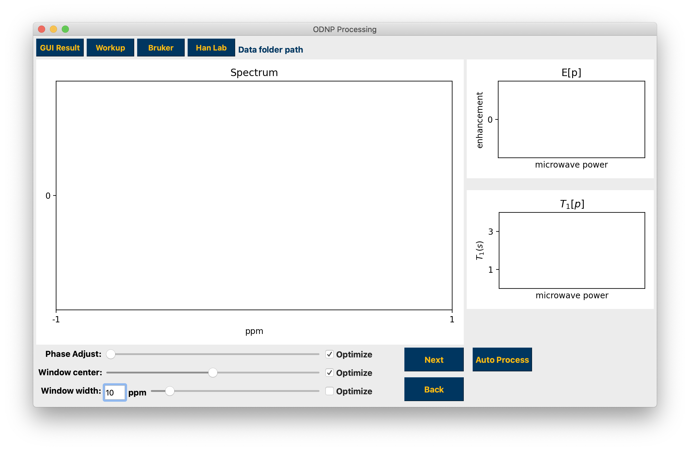
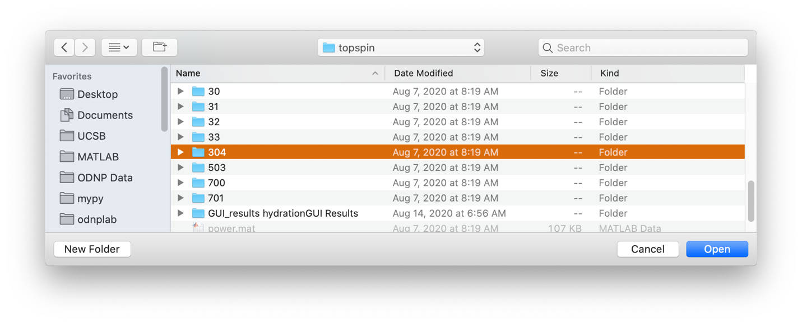
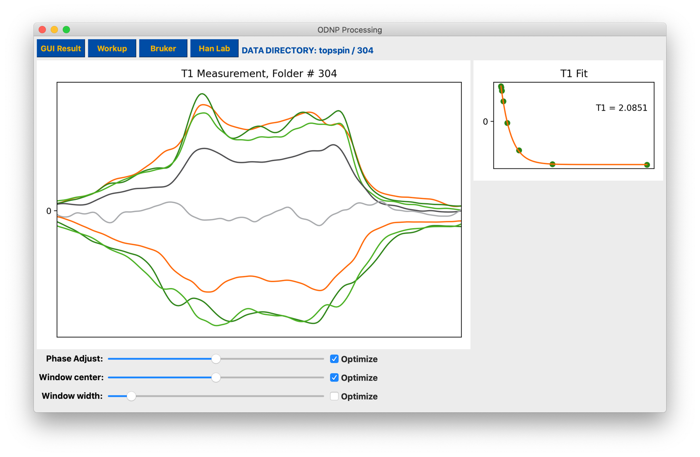
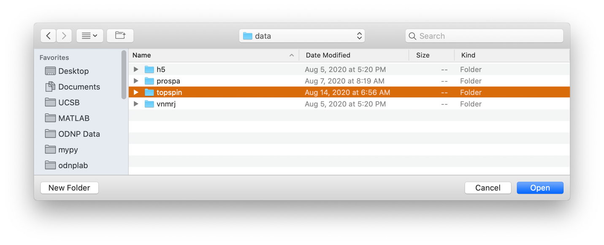
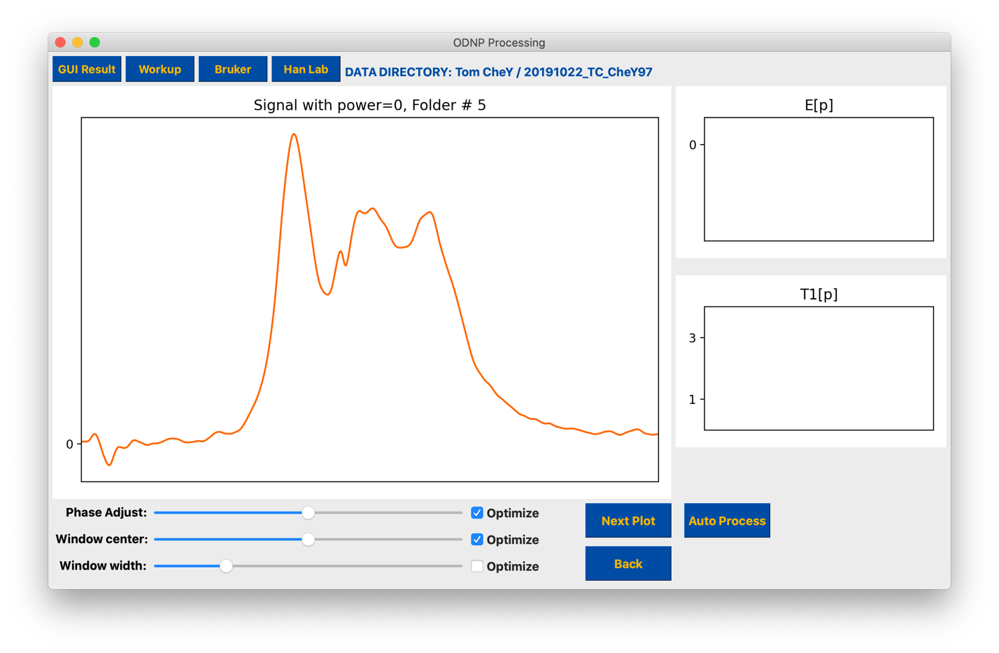
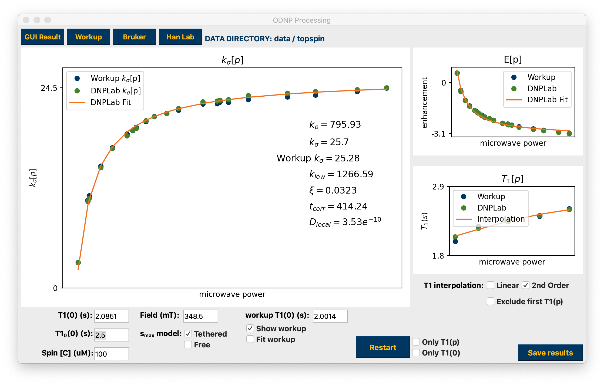
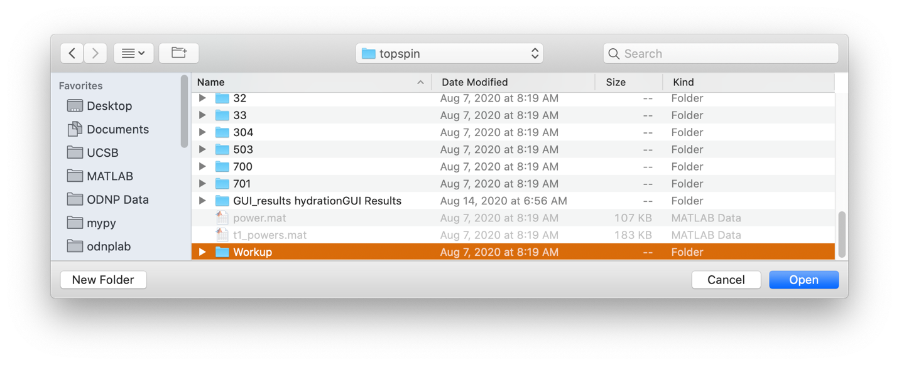
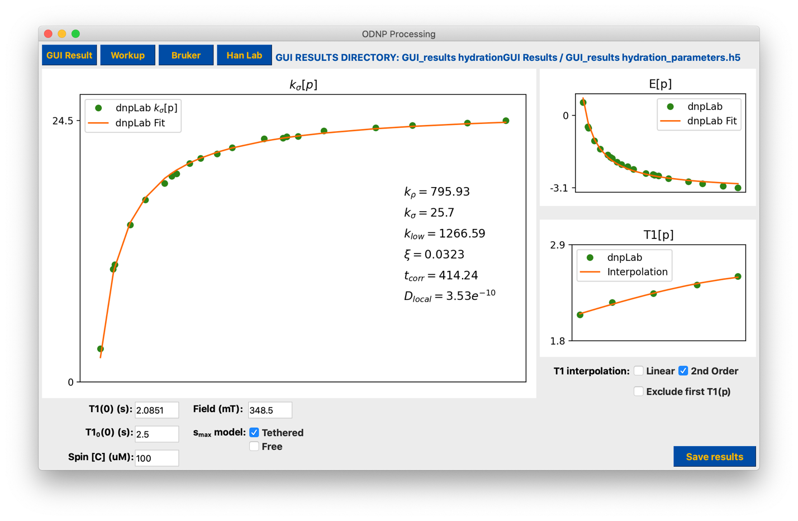
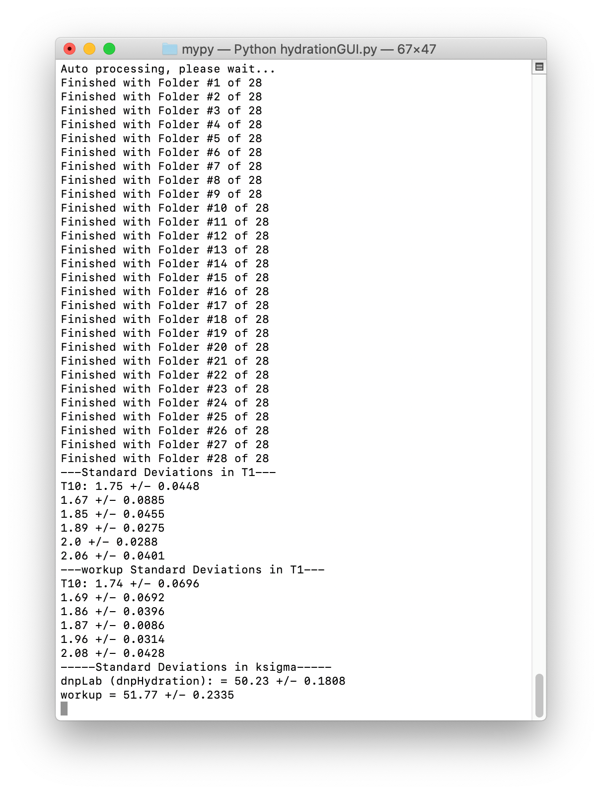

============
hydrationGUI
============

Type hydrationGUI at the command line to open an interactive tool for processing ODNP data and calculating hydration parameters. All data processing and calculating is done using buttons, checkboxes, sliders, and edit fields.

    hydrationGUI

Processing a single topspin data folder, 1D spectrum or 2D inversion recovery data
==================================================================================

To work on a single topspin spectrum use the Bruker button to select a numbered folder containing a single spectrum, either 1D or 2D. You may make adjustments to the data phase and integration window center using the sliders. Use the “Optimize” checkboxes to search for and apply the “optimal” parameters. 

    Importing 1d or 2d data

    Processing T1 experiment

Processing Han lab datasets
===========================

To load a dataset collected in the CNSI facility at University of California Santa Barbara using the ‘rb_dnp1’ command, use the Han Lab button and select the base folder.

    Importing "rb_dnp1" experiment

The title of the main plot will let you know which folder you are currently working on. Use the Next button to advance through the dataset towards calculating hydration parameters, and the Back button to regress through the dataset. Auto Process will run through the entire dataset automatically and calculate hydration parameters.

    Advance through the individual datasets to process the data

You may make adjustments to the data phase, integration window width, and integration window center using the sliders. Use the “Optimize” checkboxes to search for and apply the “optimal” parameters. For optimizing the width, checking Optimize selects the window that encompasses roughly 2/3 of the peak while unchecking selects the default width. If processing an ODNP dataset the width that is displayed in the plot will be used if the Next or Auto Process buttons are pressed. 

The results are displayed when finished. If a “Workup” is also present in the data folder it will be imported for comparison. Use the corresponding checkboxes to interact with the Workup results. Interaction with any parameter edit field or checkbox, as well as the T1 interpolation checkboxes, automatically updates the calculations. 

The title of the main plot will let you know which folder you are currently working on. Use the Next button to advance through the dataset towards calculating hydration parameters, and the Back button to regress through the dataset. Auto Process will run through the entire dataset automatically and calculate hydration parameters.

    Hydration Results

The results are displayed when finished. If a “Workup” is also present in the data folder it will be imported for comparison. Use the corresponding checkboxes to interact with the Workup results. Interaction with any parameter edit field or checkbox, as well as the T1 interpolation checkboxes, automatically updates the calculations. 

The Restart button will return you to the beginning of processing. If the Only T1(0) checkbox is selected, Restart will return you to the final folder that is the T1(0) measurement while all other processing will be retained. If the Only T1(p) is selected you will return to the beginning of the series of T1 measurements and previous processing of the enhancement points is retained. 

Analyzing previous GUI results Workup results
=============================================

You may also load only the results of “Workup” code processing with the Workup button, or you may select the .mat or .h5 files of a previously saved session with the GUI Result button. 

    Hydration Results from workup

    Hydration Results from h5

The results of previous processing will be used to calculate hydration parameters.

    Imported results from h5 file

Terminal outputs
================

The terminal will display processing and calculation progress as well as standard deviations of the T1 fits and κσ, including the imported κσ if a Workup was found. 

    Terminal Output from processing

