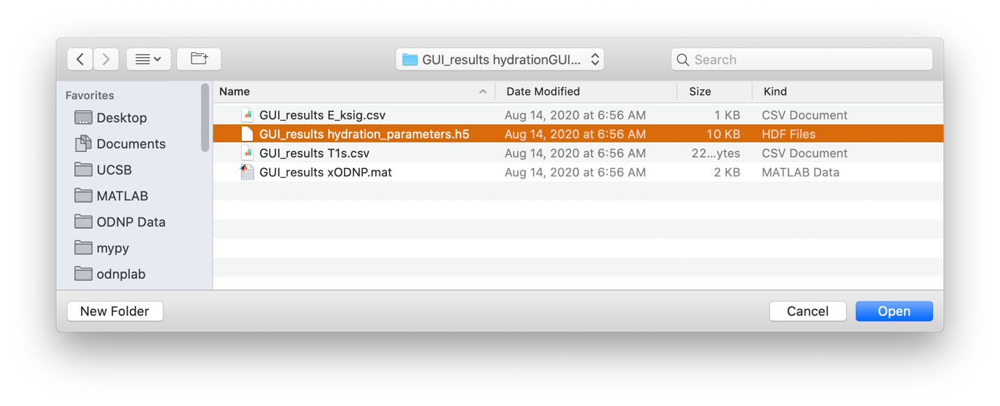

============
hydrationGUI
============

Type hydrationGUI at the command line to open an interactive tool for processing ODNP data and calculating hydration parameters. All data processing and calculating is done using buttons, checkboxes, sliders, and edit fields.

Type the command to start the hydrationGUI:

.. code-block:: console
    
    > hydrationGUI

.. figure:: _static/images/hydrationGUI_overview.png
    :width: 400
    :alt: Opening hydrationGUI
    :align: center

    Opening hydrationGUI

Processing a single topspin data folder, either a 1D spectrum or 2D inversion recovery 
==============================================================================

To work on a single topspin spectrum use the Bruker button to select a numbered folder containing a single spectrum, either 1D or 2D. You may make adjustments to the data phase and integration window center using the sliders. Use the “Optimize” checkboxes to search for and apply the “optimal” parameters. 

.. figure:: _static/images/hydrationGUI_importing_1d_2d.png
    :width: 400
    :alt: Loading 1D or 2D data
    :align: center

    Selecting data folder

.. figure:: _static/images/hydrationGUI_experiment_304.png
    :width: 400
    :alt: Example processing and fitting 2D inversion recovery experiment
    :align: center

    Example processing and fitting 2D inversion recovery experiment

Processing Han lab datasets
===========================

To load a dataset collected in the CNSI facility at University of California Santa Barbara using the ‘rb_dnp1’ command, use the Han Lab button and select the base folder. The folder must have at least the elements:

+------------------+-------------------------------+-----------------------------------------------------------------------------+
| **Folder/File**  | **type**                      | **description**                         				         |
+------------------+-------------------------------+-----------------------------------------------------------------------------+
| 5                | Folder: 1D, FID               | Spectrum at microwave power = 0                                             |
+------------------+-------------------------------+-----------------------------------------------------------------------------+
| 6-26             | Folder: 1D, FID               | FIDs collected at increasing microwave powers                               |
+------------------+-------------------------------+-----------------------------------------------------------------------------+
| 28-32            | Folder: 2D inversion recovery | T1 measurements collected at increasing microwave powers                    | 
+------------------+-------------------------------+-----------------------------------------------------------------------------+
| 304              | Folder: 2D inversion recovery | T1 measurement at microwave power = 0                                       |
+------------------+-------------------------------+-----------------------------------------------------------------------------+
| power.mat        | File: MATLAB workspace        | list of power measurements made during collecting the data in folders 6-26  |          
+------------------+-------------------------------+-----------------------------------------------------------------------------+
| t1_powers.mat    | File: MATLAB workspace        | list of power measurements made during collecting the data in folders 28-32 |   
+------------------+-------------------------------+-----------------------------------------------------------------------------+

.. figure:: _static/images/hydrationGUI_importing_rbdnp1.png
    :width: 400
    :alt: Example Importing rb_dnp1 Experiment
    :align: center

    Importing "rb_dnp1" experiment

The title of the main plot will let you know which folder you are currently working on. Use the Next button to advance through the dataset towards calculating hydration parameters, and the Back button to regress through the dataset. Auto Process will run through the entire dataset automatically and calculate hydration parameters.

.. figure:: _static/images/hydrationGUI_procesing_rbdnp1_data.png
    :width: 400
    :alt: Example Importing rb_dnp1 Experiment
    :align: center

    Advance through the individual datasets to process the data

You may make adjustments to the data phase, integration window width, and integration window center using the sliders. Use the “Optimize” checkboxes to search for and apply the “optimal” parameters. For optimizing the width, checking Optimize selects the window that encompasses roughly 2/3 of the peak while unchecking selects the default width. If processing an ODNP dataset the width that is displayed in the plot will be used if the Next or Auto Process buttons are pressed. 

The results are displayed when finished. If a “Workup" folder is also present in the data folder it will be imported for comparison. Use the corresponding checkboxes to interact with the Workup results. Interaction with any parameter edit field or checkbox, as well as the T1 interpolation checkboxes, automatically updates the calculations. 

The title of the main plot will let you know which folder you are currently working on. Use the Next button to advance through the dataset towards calculating hydration parameters, and the Back button to regress through the dataset. Auto Process will run through the entire dataset automatically and calculate hydration parameters.

.. figure:: _static/images/hydrationGUI_ksigma.png
    :width: 400
    :alt: Generating dnpHydration Results
    :align: center

    Presentation of dnpHydration results

The results are displayed when finished. If a “Workup” is also present in the data folder it will be imported for comparison. Use the corresponding checkboxes to interact with the Workup results. Interaction with any parameter edit field or checkbox, as well as the T1 interpolation checkboxes, automatically updates the calculations. 

The Restart button will return you to the beginning of processing. If the Only T1(0) checkbox is selected, Restart will return you to the final folder that is the T1(0) measurement while all other processing will be retained. If the Only T1(p) is selected you will return to the beginning of the series of T1 measurements and previous processing of the enhancement points is retained. 

Analyzing Workup results or previously saved GUI results
=========================================================

You may also load the results of “Workup” code processing with the Workup button, or you may select the .mat or .h5 files of a previously saved hydrationGUI session with the GUI Result button. The Workup folder must have at least the following elements:

+-------------------------+------------------+-------------------------------------------------------------------------------+
| **Filename**            | **File type**    | **File contains**                                                             |
+-------------------------+------------------+-------------------------------------------------------------------------------+
| enhancementPowers.csv   | .csv file        | list of enhancements and corresponding power measurements                     |                     
+-------------------------+------------------+-------------------------------------------------------------------------------+
| kSigma.csv              | .csv file        | list of [spin_concentration * κ\ :sub:`σ` * s(p)] values			     |
+-------------------------+------------------+-------------------------------------------------------------------------------+
| t1Powers.csv            | .csv file        | list of T1s and corresponding power measurements			             |
+-------------------------+------------------+-------------------------------------------------------------------------------+

.. figure:: _static/images/hydrationGUI_previous_results1.png
    :width: 400
    :alt: Importing processing results from Workup
    :align: center

    Select a Workup folder

If the mat workspace or h5 file were not saved from hydrationGUI, they can still be read and analyzed if they have the same elements. 

The mat workspace must contain a structure named "odnp" with at least the following elements (this matches the structure accepted and saved by the MATLAB App called xODNP, visit https://www.mathworks.com/matlabcentral/fileexchange/73293-xodnp):

+------------------+-----------------+--------------------------------------+
| **Variable**     | **type**        | **description**                      |
+------------------+-----------------+--------------------------------------+
| odnp.Ep          | #x1 Double      | list of signal enhancements          |      
+------------------+-----------------+--------------------------------------+
| odnp.Epowers     | #x1 Double      | list of powers used to collect Ep    |                 
+------------------+-----------------+--------------------------------------+
| odnp.T1p         | #x1 Double      | list of T1 values                    |
+------------------+-----------------+--------------------------------------+
| odnp.T1p_stdd    | #x1 Double      | list of standard deviations in T1p   |              
+------------------+-----------------+--------------------------------------+
| odnp.T1powers    | #x1 Double      | list of powers used to collect T1p   |                 
+------------------+-----------------+--------------------------------------+
| odnp.T10         | single number   | T1 value for power = 0, i.e. T1(0)   |               
+------------------+-----------------+--------------------------------------+
| odnp.T10_stdd    | single number   | standard deviation in T10            |     
+------------------+-----------------+--------------------------------------+

The h5 must contain a dictionary named 'hydration_inputs' with at least the following elements:

+------------------+-----------------+--------------------------------------+
| **key**          | **type**        | **description**                      |
+------------------+-----------------+--------------------------------------+
| E                | numpy array     | list of signal enhancements          |      
+------------------+-----------------+--------------------------------------+
| E_power          | numpy array     | list of powers used to collect Ep    |                 
+------------------+-----------------+--------------------------------------+
| T1               | numpy array     | list of T1 values                    |
+------------------+-----------------+--------------------------------------+
| T1_power         | numpy array     | list of powers used to collect T1p   |                 
+------------------+-----------------+--------------------------------------+
| T10              | float           | T1 value for power = 0, i.e. T1(0)   |               
+------------------+-----------------+--------------------------------------+

and a separate dictionary named 'hydration_results' with at least the following elements:

+------------------+-----------------+--------------------------------------+
| **key**          | **type**        | **description**                      |
+------------------+-----------------+--------------------------------------+
| T1_stdd          | numpy array     | list of standard deviations in T1    |     
+------------------+-----------------+--------------------------------------+
| T10_stdd         | float           | standard deviation in T10            |                 
+------------------+-----------------+--------------------------------------+

    Select a saved mat or h5 file

The results of previous processing will be used to calculate hydration parameters.

.. figure:: _static/images/hydrationGUI_results_from_h5.png
    :width: 400
    :alt: Imported hydrationGUI Results
    :align: center

    Analyzed results from previously saved Workup, mat workspace, or h5

Terminal outputs
================

The terminal will display processing and calculation progress as well as standard deviations of the T1 fits and κ\ :sub:`σ`, including the imported κ\ :sub:`σ` if a Workup was found. 

.. figure:: _static/images/hydrationGUI_terminal.png
    :width: 400
    :alt: Terminal Outputs
    :align: center

    Terminal outputs during processing and calculations

Saving Results
================

After processing is complete and hydration parameters are calculated, the Save results button is available. Your results are saved in .csv, .h5, and .mat formats. The .mat file can be read by the MATLAB app called xODNP that is available at MathWorks File Exchange. The .h5 and .mat files can be read by hydrationGUI.

